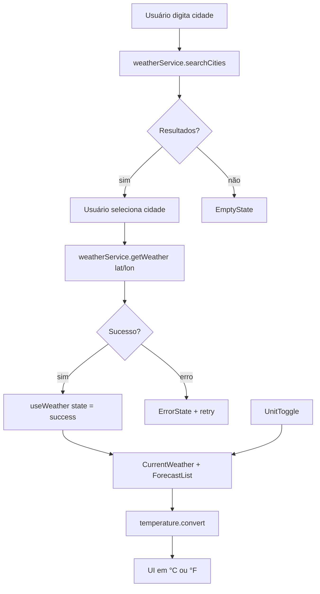

# Plano Técnico — Weather App

## Architecture

A aplicação será construída como uma SPA em React com arquitetura em camadas e fluxo de dados unidirecional. A responsabilidade de cada camada será clara para facilitar manutenção, testes e evolução posterior do produto.

- **Apresentação**: componentes em `src/components/` recebem dados por props e se concentram na renderização e interação.
- **Orquestração e estado**: hook `useWeather` centraliza busca, carregamento, erro e estado da cidade selecionada.
- **Acesso a dados**: `src/services/` encapsula chamadas HTTP para a Open-Meteo, isolando a lógica de rede.
- **Funções puras**: `src/lib/` concentra conversão de temperatura, mapeamento de código do clima e formatação de dados.
- **Contratos**: `src/types/` define as interfaces compartilhadas entre camadas.

Essa separação reduz acoplamento, facilita mock de testes e evita que regras de negócio fiquem espalhadas pela UI.

## Tech Stack

| Camada | Tecnologia | Justificativa |
| --- | --- | --- |
| Linguagem | TypeScript (strict) | Segurança de tipos e contratos explícitos |
| UI | React + Vite | Ferramenta leve e rápida para SPA |
| Estilo | Tailwind CSS | Produtividade e tema dark glassmorphism |
| Testes unitários | Vitest + Testing Library | Velocidade e integração com Vite |
| Testes E2E | Playwright | Validação de fluxos reais e viewport mobile |
| Dados | Open-Meteo | Gratuito, sem API key e compatível com deploy estático |

## Project Structure

```text
src/
├── components/
│   ├── SearchBar.tsx
│   ├── CurrentWeather.tsx
│   ├── ForecastList.tsx
│   ├── ForecastCard.tsx
│   ├── UnitToggle.tsx
│   └── states/
│       ├── LoadingState.tsx
│       ├── ErrorState.tsx
│       └── EmptyState.tsx
├── hooks/
│   └── useWeather.ts
├── services/
│   └── weatherService.ts
├── lib/
│   ├── temperature.ts
│   ├── weatherCodes.ts
│   └── format.ts
├── types/
│   └── weather.ts
├── App.tsx
└── main.tsx
```

A organização prioriza separação clara entre UI, serviços, utilitários e tipos, o que reduz risco de regressões e facilita a criação de testes focados.

## Data Model

```ts
export type Unit = 'celsius' | 'fahrenheit';

export interface City {
  id: number;
  name: string;
  country: string;
  admin1?: string; // estado ou região, quando disponível
  latitude: number;
  longitude: number;
}

export interface CurrentWeather {
  temperature: number; // em °C internamente
  weatherCode: number;
  humidity: number;
  windSpeed: number;
  pressure: number;
  precipitation: number;
  time: string;
}

export interface ForecastDay {
  date: string;
  min: number; // em °C internamente
  max: number; // em °C internamente
  weatherCode: number;
  precipitationProbability: number;
}

export interface WeatherData {
  city: City;
  current: CurrentWeather;
  forecast: ForecastDay[]; // hoje + 4 dias seguintes
}
```

> Decisão: manter os dados internos em Celsius e realizar a conversão apenas na renderização para a unidade exibida. Isso evita sincronização inconsistente e mantém a lógica centralizada.

## Data Flow



## External APIs

### Geocoding

```text
GET https://geocoding-api.open-meteo.com/v1/search?name={cidade}&count=5&language=pt&format=json
```

Parâmetros relevantes:
- `name`: nome da cidade pesquisada
- `count`: número de resultados sugeridos
- `language`: idioma da resposta (`pt`)
- `format`: formato JSON

Resposta esperada:
- `results[]` com campos como `name`, `country`, `admin1`, `latitude`, `longitude`

Mapeamento:
- `results` → `City[]`
- `latitude`/`longitude` → coordenadas da cidade selecionada

### Forecast

```text
GET https://api.open-meteo.com/v1/forecast
  ?latitude={lat}&longitude={lon}
  &current=temperature_2m,relative_humidity_2m,wind_speed_10m,surface_pressure,precipitation,weather_code
  &daily=weather_code,temperature_2m_max,temperature_2m_min,precipitation_probability_max
  &forecast_days=5
  &timezone=auto
```

Parâmetros relevantes:
- `latitude`, `longitude`: coordenadas da cidade selecionada
- `current`: campos climáticos atuais
- `daily`: campos da previsão diária
- `forecast_days`: 5 dias (hoje + 4 seguintes)
- `timezone`: `auto` para ajustar datas ao fuso local

Mapeamento:
- `current` → `CurrentWeather`
- `daily` → `ForecastDay[]`

## State Management

A gestão de estado fica concentrada no hook `useWeather`, que será responsável por:

- manter a cidade selecionada
- controlar status de busca (`idle | loading | success | error | empty`)
- armazenar erros e mensagens de UI
- orquestrar a chamada de geocoding e forecast
- manter a unidade atual (`celsius | fahrenheit`)

A conversão de Celsius para Fahrenheit acontece derivada na renderização, sem novo request. Isso reduz problemas de inconsistência entre estado e interface.

## Error Handling

A estratégia de erros será simples, explícita e amigável ao usuário:

- `AbortController` para cancelar requests pendentes em caso de nova busca
- `state = 'error'` em falhas de rede, timeout ou API indisponível
- `state = 'empty'` quando a busca não retorna resultados
- resposta parcial: campos ausentes são renderizados como "—" ou equivalente sem quebrar a UI
- botão de "tentar novamente" na tela de erro
- feedback visual com loading durante a chamada

## Testing Strategy

### Vitest

Cobrir com testes unitários:
- funções puras de conversão de temperatura
- mapeamento de códigos meteorológicos para rótulos/ícones
- `weatherService` com `fetch` mockado, cobrindo sucesso, falha e timeout
- componentes em estados de loading, empty, error e success

### Playwright

Cobrir com testes E2E:
- busca por cidade
- seleção de cidade em sugestões
- leitura do clima atual
- previsão de 5 dias
- alternância de unidade Celsius/Fahrenheit
- comportamento em viewport mobile

## Risks & Trade-offs

- **Sem cache**: simplifica a implementação e reduz complexidade, mas repete requests em buscas frequentes. Aceitável para a v1.
- **Sem biblioteca de estado global**: reduz dependências e curva de aprendizado, mas exige controle mais cuidadoso do hook `useWeather`.
- **Conversão derivada na renderização**: evita duplicação de estado e bugs de sincronização; custo de recomputação é baixo para o escopo atual.
- **Open-Meteo sem chave**: reduz barreiras de implantação, porém depende da disponibilidade da API pública e da política de rate limiting.

## Resumo Executivo

O plano define uma aplicação React + TypeScript com arquitetura em camadas, dados vindos da Open-Meteo e gerenciamento de estado centralizado em um hook. A conversão de temperatura ocorre na renderização, sem recarregar dados, e a estratégia de testes cobre tanto funções puras quanto fluxos de usuário reais. O foco é entregar uma solução simples, responsiva e fácil de manter para a v1 do produto.
